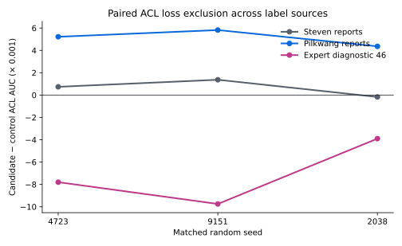

# When report-derived labels disagree with expert MRI labels: a paired pilot in knee abnormality detection

**Research report draft · 26 September 2026**  
**Status:** exploratory, unreviewed methods report; not a clinical validation study or a claimed leaderboard improvement.

## Abstract

Knee MRI competitions provide many radiology reports but comparatively few expert image labels. Reports can omit a finding, and different automated report readers can disagree even when both issue explicit labels. We investigated whether changing the training loss for uncertain or contradictory report labels improves a compact MRI classifier. A fixed report-text-group split of 4,407 competition training studies assigned 3,476 studies to training, 869 to a report-label holdout, and excluded 62 studies in groups containing any of the 58 expert-labeled studies. A precomputed 4,608-dimensional ConvNeXt image feature cache supported paired, 12-epoch CPU classification-head experiments without additional GPU training. Three matched random seeds were used for the principal disagreement experiments. The most focused intervention removed the ACL loss on 198 training entries where two report readers explicitly disagreed. ACL AUC improved by 0.00436–0.00582 against one reader's holdout labels, but declined by 0.00390–0.00975 against the 46 available expert-labeled diagnostic studies. A broader half-weight intervention affected 666 entries and produced near-zero macro-AUC changes. These observations show that an apparent gain against report-derived labels did not consistently transfer to the available expert-labeled diagnostic sample. Because the expert sample is small and was available to developers of public label sources, this is a methodological warning rather than an unbiased estimate of MRI performance. No new competition submission or claim of improvement over the reproduced 0.943 public score follows from these pilots.

## 1. Question and motivation

**Question.** When two report-derived label sources disagree, does reducing the influence of their contradictory entries improve predictions against held reports and expert image labels in the same direction?

The competition asks for probabilities for 12 knee abnormalities from MRI. Our first competition submission used a frozen ConvNeXt-Tiny feature extractor and five classification heads, scoring 0.782 on the public leaderboard. Later submissions reproduced credited public multi-model ensembles and scored 0.941 and 0.943. Those submissions changed whole prediction systems, including image representations, preprocessing and fusion; their score differences do not isolate a mechanism and are not original model improvements. This report instead examines one controlled, independently implemented training intervention on fixed cached features. The public 0.943 reproduction is context, **not** a baseline evaluated on this report-label holdout.

An absent mention in a report is not necessarily an image-negative finding. Steven v1 marked 3,271 synovitis entries as unknown that Steven v2 subsequently filled using an effusion-based proxy. The Pilkwang reader marked 2,945 of the 3,476 training studies as unknown for synovitis. For ACL, two readers explicitly disagreed on 198 training entries, with 197 having Steven v2 negative and Pilkwang positive. This asymmetry motivated a focused ACL check, but disagreement alone cannot adjudicate the MRI truth.

## 2. Data, provenance and design

### 2.1 Partitions and labels

The official training table contains 4,407 study identifiers. The Steven report label file covers all 4,407; the Pilkwang file lacks one study. A deterministic split normalizes report text by case and whitespace and groups identical normalized reports. All groups containing any of the 58 expert-labeled studies were excluded from report-label fitting and holdout scoring, removing 62 rows. The remaining 4,345 rows yielded 3,476 training and 869 held studies. There was no overlap of normalized report groups across partitions. A separate DICOM-header audit found nonempty, distinct released patient identifiers for all 4,407 studies and no cross-partition repeated released identifier; deidentification may assign a new identifier to repeat studies, so this does **not** establish original-patient independence.

Forty-six of the expert-labeled studies have frozen features and form a separate **diagnostic** set. Twelve expert studies were absent from the 4,395-study cache. The 46 are not an untouched external test set: expert labels were available to some public label developers, and their case mix and per-target class counts are small. The report-label holdout is also not expert image truth.

### 2.2 Feature and head controls

The cached image matrix contains 4,395 studies × 4,608 ConvNeXt features. The source file passed its pinned SHA256 check (`7b2d7e864205dfe71b222050d354e96712c3902a9e84aafea5fc30019d845139`). Each paired control and intervention used the same feature rows, initial random seed, minibatch schedule, head architecture and 12-epoch budget. This isolates the specified loss or label-source change **within this frozen-feature classifier**, but does not isolate a change in a full MRI backbone or in the public V3 ensemble. Three paired seeds were used for the disagreement interventions: 4723, 9151 and 2038. The earlier missing-label and label-source screens used their recorded seed sets separately.

For each target, AUC was calculated on the same explicitly observed label subset for both paired arms. Unobserved report labels were not silently turned into negatives; a target without both classes would be unscorable. Macro AUC is the mean across the 12 scorable targets. Report-group bootstrap intervals quantify sampling variation for the paired difference under the observed grouping, not uncertainty about label correctness. Experiments across multiple targets, endpoints and candidate rules are exploratory; nominal intervals are not multiplicity-adjusted.

### 2.3 Interventions

1. **General contradiction weighting:** use Steven v2 soft training targets; multiply the loss weight by 0.5 only for 666 target entries where Steven and Pilkwang give explicit contradictory verdicts.
2. **Focused ACL exclusion:** keep Steven v2 targets and all other target losses, but set ACL loss to zero for the 198 explicitly contradictory ACL training entries. The rationale drew on the host's ACL definition, but a report-level degeneration word count cannot adjudicate an individual ACL finding.
3. **Exploratory screens:** compare ordinary and explicit-unknown masking; separately compare Steven v2 and publicly released Steven/lixin73 v4 training targets. These are separate research questions and cannot be pooled into one confirmatory test.

## 3. Results

### 3.1 Primary methodological signal: contradictory ACL targets

| Endpoint; ACL AUC change, intervention minus paired control | Seed 4723 | Seed 9151 | Seed 2038 |
| --- | ---: | ---: | ---: |
| Held Steven explicit report labels (801 eligible; 217 positive) | +0.00074 | +0.00137 | −0.00017 |
| Held Pilkwang explicit report labels (803 eligible; 249 positive) | +0.00522 | +0.00582 | +0.00436 |
| Expert46 diagnostic labels (46 eligible; 19 positive) | −0.00780 | −0.00975 | −0.00390 |

Only one of the 12 target losses changed. Accordingly, the corresponding 12-target macro changes were small: held Steven +0.000062/+0.000114/−0.000014; held Pilkwang +0.000435/+0.000485/+0.000364; expert46 −0.000650/−0.000812/−0.000325. The held Pilkwang assessment is not independent of how intervention entries were selected, since Pilkwang disagreement determined the training exclusion. All recorded held-Steven and expert46 paired 95% macro intervals crossed zero. The consistent expert46 ACL direction is a cautionary signal, not proof of harm in the population. It prevents claiming an expert-label gain from the held-Pilkwang result.



**Figure 1.** Three matched seeds for the same ACL loss intervention. The vertical axis shows the candidate-minus-control ACL AUC difference in units of 0.001. The lines join repeated training seeds to guide comparison, not a temporal trend. Positive changes against the Pilkwang report reader and negative changes in the 46-case expert diagnostic sample should not be interpreted as independent population effects. The full numerical values and eligible class counts appear in the preceding table.

### 3.2 Broader contradiction weighting

| Macro AUC change, half-weight minus control | Seed 4723 | Seed 9151 | Seed 2038 |
| --- | ---: | ---: | ---: |
| Held Steven explicit labels | +0.000030 | +0.000044 | +0.000016 |
| Held Pilkwang explicit labels | +0.000356 | +0.000393 | +0.000268 |
| Expert46 diagnostic labels | +0.000345 | −0.000196 | −0.000675 |

This wider rule produced changes that were small relative to evaluation uncertainty and expert46 effects of mixed sign. It did not supply a promotion criterion for full GPU training or a formal competition submission.

### 3.3 Checks against simple alternative label changes

Explicit unknown-label masking changed held report-label macro AUC by only +0.000033, +0.000079 and +0.000036 across three matched initializations. For one seed, the 95% group-bootstrap interval was [−0.00518, +0.00568]. The expert46 diagnostic gains of approximately +0.0055 to +0.0064 had intervals crossing zero; for one seed the interval was [−0.01799, +0.02747]. Substituting Steven/lixin73's public v4 report labels for Steven v2 changed the separate Pilkwang-held macro AUC by −0.001760, −0.002462 and −0.000498 across matched seeds, although expert46 diagnostic AUC rose. The public v4 labels belong to their authors, and expert46 had potentially informed their development. Neither comparison establishes improvement against independent expert labels or over the V3 ensemble.

## 4. Interpretation and limitations

The strongest conclusion is about **measurement**: an ACL intervention selected using disagreement with one automated report reader looked better against that reader's holdout verdicts, while the limited expert diagnostic comparison pointed in the opposite direction. A report reader can encode a different threshold from the expert image definition, and agreement between automated readers is not adjudication. The study cannot determine which reader is correct for any individual MRI.

Several restrictions prevent a clinical or leaderboard claim. Expert46 is small, source-label development may have used related gold information, and the released identifiers do not prove unique original patients. A frozen-feature linear head is an inexpensive proxy; results need not transfer to end-to-end training or a large ensemble. The report-label holdout shares a label-generation process with training even though report text groups are separated. Multiple exploratory interventions and 12 targets increase the chance of chance findings. The Kaggle public score uses a different hidden test set and cannot be directly compared to any 0.7–0.8 report-label AUC in this document. The saved V3 branch outputs cover only three visible test studies and do not support same-case AUC or component attribution.

**Decision at this stage:** retain the credited public V3 reproduction at 0.943 as the best verified competition submission. Do not describe the pilots as an original leaderboard improvement, clinical validation, an accepted paper, or a prize. No extra Kaggle GPU time or new formal submission was used for these reported CPU pilots.

## 5. Next experiment and completion criteria

The next meaningful test requires an independently adjudicated, eligible MRI set with sufficient positives and negatives per target, plus matched predictions from a baseline and a candidate on the **same studies**. Before collecting results, freeze inclusion rules, preprocessing, endpoints, comparison and a minimum practically relevant effect. Check dataset permissions and competition rules before using outside data; do not commission labels on restricted validation/test records. If a comparable 12-target set is unavailable, a narrower ACL-only external-domain study may be informative if label definitions, licensing and input compatibility are resolved, but it would not validate a 12-target competition claim.

For an application portfolio, the deliverable is this transparent methods report plus runnable scripts, input hashes, aggregate target counts and negative results. Figure 1 and the reproduction guide below support review of the key result. A future revision should add a patient- and report-group flow diagram and, if independent labels become available, a prespecified external validation. Such a portfolio demonstrates experimental judgment even if no candidate improves the leaderboard.

## Reproduction guide

The scripts named below are separately saved project files. This guide intentionally does not redistribute the competition's MRI, report text, identifiers or third-party label files. Obtain eligible inputs from their original sources under their access terms. Run from a directory containing the four scripts named in the commands. Use Python with `numpy`, `pandas`, and `scipy`. The frozen feature file must be the original 4,395 × 4,608 cache; the loader checks its pinned SHA256. The manifest and official `train.csv` must align exactly on study ID. Substitute **local paths** for the capitalized placeholders; do not copy the placeholders literally.

```bash
python prepare_rsna_report_masks.py \
  --steven-v1 STEVEN_V1.csv --steven-v2 STEVEN_V2.csv \
  --pilkwang PILKWANG.csv --train TRAIN.csv \
  --split-seed rsna-v4-mask-holdout-2026-09-25 \
  --output-prefix rsna_report_manifest

python rsna_label_quality_gate.py \
  --manifest rsna_report_manifest.csv --train-csv TRAIN.csv \
  --output rsna_label_quality_gate.json

python rsna_cpu_disagreement_pilot.py \
  --features FROZEN_FEATURES.pt --manifest rsna_report_manifest.csv \
  --train-csv TRAIN.csv --output acl_seed_4723.json \
  --seed 4723 --epochs 12 --bootstrap 500 \
  --ablation drop_acl_conflict
```

Repeat the final command for seeds `9151` and `2038`, giving each run a distinct output path. For the broader 666-entry intervention, change only `--ablation` to `half_all` and use separate outputs. Before interpretation, check that the first two commands report 3,476 training, 869 held and 62 excluded studies; the ACL run should report 198 affected target entries. Verify the feature hash, manifest hash, eligible target counts, per-target AUC and paired bootstrap output in each JSON. This is a reproduction recipe for the **CPU proxy experiment**, not a recipe to reproduce public V3 or its leaderboard score. The reported bootstrap draws and seeds do not turn the diagnostic expert sample into an independent test set.

## Contribution and attribution ledger

| Component | Origin and status | Claim supported here |
| --- | --- | --- |
| ConvNeXt-Tiny feature baseline and five-head V1 submission | This project's original baseline implementation and submission | Engineering baseline, public AUC 0.782; not a controlled branch ablation. |
| V2 and V3 multi-model MRI ensembles, released checkpoints and fusion recipes | Public works credited to prvsiyan, Mattia Angeli and their cited contributors | Reproduced public scores 0.941 and 0.943; no original architecture or score gain is claimed. |
| Steven, Pilkwang and Steven/lixin73 report-label sources | Public third-party report interpretation | Inputs to label-quality audit and CPU pilots; not project-created expert ground truth. |
| Report-group split, source alignment, missingness audit and paired CPU loss interventions | Independently recorded project experiments described in the audit and scripts below | Exploratory methodological findings and negative/inconclusive results; not independent clinical validation. |

The V2 copied notebook includes first-person wording and an earlier five-submission history; those passages alone do not demonstrate that this project ran the source author's experiments. Only independently recorded local runs and the three verified submissions are attributed to this project.

## Source and reproducibility ledger

- Internal experiment audit: `RSNA_V4_validation_audit.md` (version 10 as read 26 September 2026).
- Split and label audit: `scripts/prepare_rsna_report_masks.py`, `scripts/rsna_label_quality_gate.py`, [`results/rsna_label_quality_gate.json`](../results/rsna_label_quality_gate.json).
- Paired CPU scripts and records: `scripts/rsna_cpu_mask_pilot.py`, `scripts/rsna_cpu_disagreement_pilot.py`, [`results/rsna_acl_drop_pilot_results.json`](../results/rsna_acl_drop_pilot_results.json), [`results/rsna_disagreement_pilot_results.json`](../results/rsna_disagreement_pilot_results.json), `scripts/rsna_cpu_v4_source_pilot.py`. The v4 label-source result file is not part of this repository.
- [Official competition](https://www.kaggle.com/competitions/rsna-knee-abnormality-detection), [label definitions](https://www.kaggle.com/competitions/rsna-knee-abnormality-detection/discussion/733343), [V1 submission](https://www.kaggle.com/code/zijiacheng521/rsna-knee-submission-v1?scriptVersionId=350564639), [V2 credited reproduction](https://www.kaggle.com/code/zijiacheng521/the-bee-s-knees-final-rsna-push?scriptVersionId=352475001), [V3 credited reproduction](https://www.kaggle.com/code/zijiacheng521/rsna-knee-v3-mattia-v39-attributed-reproduction?scriptVersionId=352573490).

**Authorship note.** Public ensemble architectures, weights, training-label sources and their original experiments remain credited to their respective authors. Text inherited inside a copied Notebook, including its first-person claims, is not evidence that the copier conducted those experiments. This report describes the later independently recorded split audit and paired CPU pilots; it does not claim authorship of V2/V3 modelling advances.
